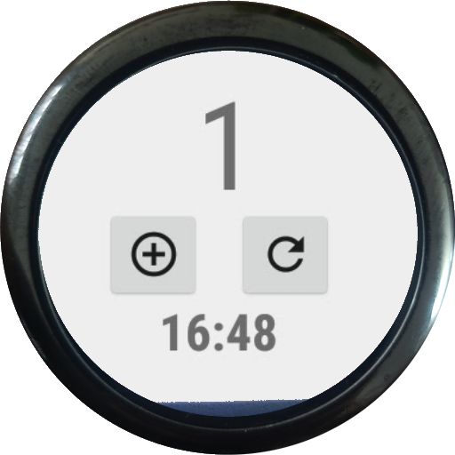

# StepCounter
Step counter app for Amazfit Pace smartwatch

## 🚀 Usage

Download the repository, open the /B4A/StepCounter.b4a and compile the project. Get the file \B4A\Objects\StepCounter.apk and install in on Amazfit Pace. 
You can find and launch the app in the app list, if you don't have the list you can enable it using [these](https://forum.xda-developers.com/t/amazfit-enable-app-list-on-us-cn-through-adb.3574454/) or [these](https://www.youtube.com/watch?v=Skhf-jiN2kQ) istructions (or just search Amazfit Enable app list).
The app has a label for the counter and two buttons, one adds 1 step on the counter and the other just resets it.

## 🤝 Contributing

Contributions, issues and feature requests are welcome. 
Feel free to check [issues page](https://github.com/fkossyvas/StepCounter/issues) if you want to contribute. 

## 🔲 TODO

- Add an about dialog, so i can credit B4A and Icons8 directly in the app
- Make it become a Widget so it can be installed directly on the Pace home launcher (Springboard)

## 👤 Author

**Fotios Kossyvas**

- Twitter: [@fkossyvas](https://twitter.com/fkossyvas)
- Github: [@fkossyvas](https://github.com/fkossyvas)

## Show your support

Please ⭐️ this repository if this project helped you!

## 📝 Copyright

StepCounter is Copyright © 2021 Fotios Kossyvas. A copy of the license is available in the distributed LICENSE file.

StepCounter has been developed using the amazing [B4A](https://www.b4x.com/b4a.html) from Anywhere Software
The app icon is based on the Counter icon by [icons8](https://icons8.com/)

